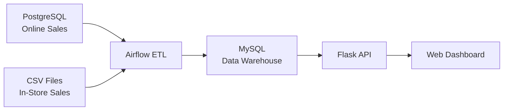

# Retail Sales ETL Pipeline & Analytics Dashboard

A comprehensive microservices-based ETL (Extract, Transform, Load) pipeline with real-time analytics dashboard, built using Apache Airflow, Docker, and modern web technologies.

## Architecture Overview

This project demonstrates a production-ready data pipeline architecture that processes retail sales data from multiple sources and provides real-time analytics through a web dashboard.

### System Components

- **Data Sources**: PostgreSQL (online sales) + CSV files (in-store sales)
- **ETL Orchestration**: Apache Airflow with custom DAGs
- **Data Warehouse**: MySQL for aggregated analytics
- **API Layer**: Flask REST API with SQLAlchemy ORM
- **Frontend**: Responsive web dashboard with Chart.js visualizations
- **Infrastructure**: Docker containers with service mesh networking

## Features

- **Automated ETL Pipeline**: Scheduled data extraction, transformation, and loading
- **Multi-Source Integration**: Combines database and file-based data sources
- **Real-Time Dashboard**: Interactive charts and analytics
- **Microservices Architecture**: Scalable, containerized services
- **Health Monitoring**: Built-in health checks and logging
- **Environment Configuration**: Secure credential management

## Technology Stack

| Component | Technology |
|-----------|------------|
| **Orchestration** | Docker, Docker Compose |
| **ETL Pipeline** | Apache Airflow 2.6.3 |
| **Backend API** | Python, Flask, SQLAlchemy |
| **Frontend** | HTML5, Bootstrap, Chart.js |
| **Data Processing** | Pandas, NumPy |
| **Databases** | PostgreSQL 13, MySQL 8.0 |
| **Networking** | Docker bridge networks |

## Prerequisites

- Docker Engine 20.10+
- Docker Compose 1.29+
- 4GB+ available RAM
- Ports 5000, 8050, 8080, 3307, 5433 available

## Quick Start

### 1. Clone and Setup

```bash
git clone <repository-url>
cd retail-etl-dashboard
```

### 2. Environment Configuration (Optional)

For custom credentials, create a `.env` file in the project root. The application works with default credentials out of the box.

### 3. Deploy Services

```bash
# Make deployment script executable
chmod +x deploy.sh

# Deploy all services
./deploy.sh
```

**Alternative (manual deployment):**
```bash
docker-compose down --remove-orphans
docker-compose build
docker-compose up -d
```

### 4. Access Applications

Wait 2-3 minutes for all services to initialize, then access:

| Service | URL | Credentials |
|---------|-----|-------------|
| **Analytics Dashboard** | http://localhost:8050 | None required |
| **Airflow Web UI** | http://localhost:8080 | admin / admin |
| **API Health Check** | http://localhost:5000/api/health | None required |

### 5. Run ETL Pipeline

1. Navigate to Airflow UI (http://localhost:8080)
2. Locate `retail_sales_etl` DAG
3. Ensure DAG is unpaused (toggle ON)
4. Click "Trigger DAG" to run the pipeline
5. Monitor execution progress in the Airflow UI
6. Refresh the dashboard to see processed data

## Data Flow



1. **Extract**: Data pulled from PostgreSQL and CSV sources
2. **Transform**: Data cleaning, validation, and aggregation using Pandas
3. **Load**: Processed data stored in MySQL data warehouse
4. **Serve**: Flask API exposes data via REST endpoints
5. **Visualize**: Web dashboard displays interactive analytics

## Configuration

### Environment Variables

Key configuration options in `.env`:

```bash
# Database Settings
POSTGRES_PASSWORD=your_secure_password
MYSQL_ROOT_PASSWORD=your_mysql_password

# Airflow Security
AIRFLOW_FERNET_KEY=your_fernet_key
AIRFLOW_SECRET_KEY=your_secret_key
AIRFLOW_WWW_USER_PASSWORD=your_admin_password

# Service Ports
API_PORT=5000
FRONTEND_PORT=8050
AIRFLOW_PORT=8080
```

### Data Sources

- **Online Sales**: Stored in PostgreSQL (`online_sales` table)
- **In-Store Sales**: CSV files in `/data` directory
- **Output**: Aggregated data in MySQL (`sales_aggregated` table)

## API Endpoints

| Endpoint | Method | Description |
|----------|--------|-------------|
| `/api/health` | GET | Service health check |
| `/api/sales` | GET | All aggregated sales data |
| `/api/sales/{id}` | GET | Sales data for specific product |
| `/api/sales/top/{limit}` | GET | Top N products by sales |

## Monitoring & Debugging

### View Container Logs
```bash
# View specific service logs
docker logs <container_name>

# Examples
docker logs retail-etl-dashboard-frontend-1
docker logs retail-etl-dashboard-airflow-scheduler-1
```

### Health Checks
```bash
# API health
curl http://localhost:5000/api/health

# Container status
docker-compose ps
```

### Data Verification
```bash
# Connect to MySQL data warehouse
docker exec -it retail-etl-dashboard-mysql-1 mysql -u root -p
```


